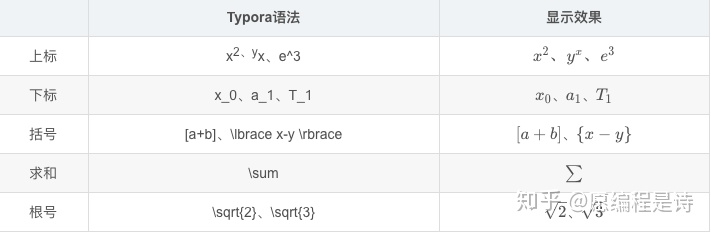
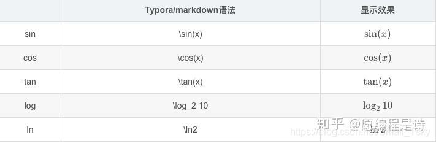
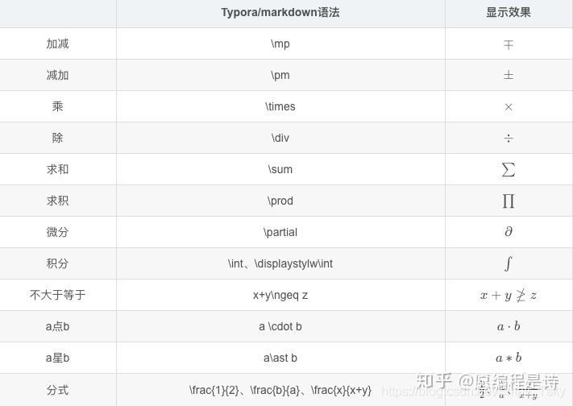
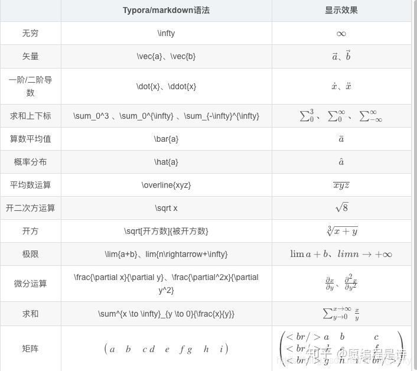
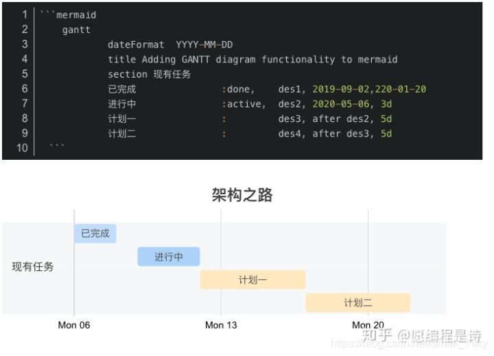
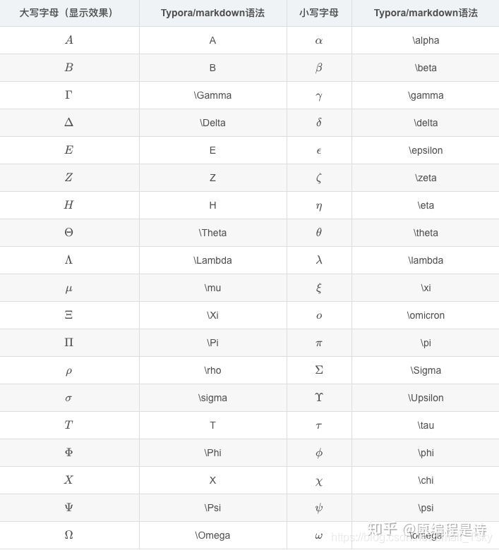
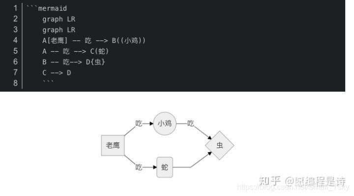
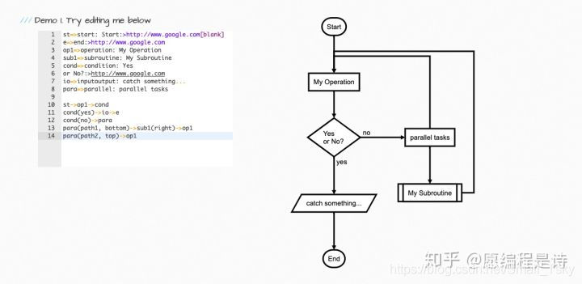

typora教程
=============
toc[]
# 一.常用功能
[TOC]
1.视图里面和Ctrl+/键可以切换源代码模式。
2.主题可以切换，可以到官网下载。                                   
3.可以在工具栏查看快捷键。
4.偏好设置可以设置更多文本编辑,扩展语法等功能。
5.在对应位置输入*[TOC]*可以插入目录
# 二.语法<a name ="跳转到上一个标题"></a>
## 一.标题
# 一级标题（注意一定要在#号后面打上空格）
## 二级标题
### 三级标题
#### 四级标题
##### 五级标题
###### 六级标题

## 二.字体
**加粗**
*倾泻*
***斜体加粗***
~~删除线~~(是两个小弯弧线)
==高亮==
我是^上标^
我是~下标~

## 三.列表
### 1.无序列表
+ 一二三四五
  * 上山打老虎 
    + 老虎不在家 
      - 打到小松鼠
      **+-*号均可以，注意空格***
      **分级是空两格**
### 2.有序列表
1. 凑数专用
2. 凑数专用
3. 显示是一样的，注意点后面加一个空格，回车两次回取消自动跟进。

### 3.任务列表
- [] 未完成任务
- [x]已完成任务
## 四.表格
| Mon | Tue | Wes | THU |FRI|
|:-|-:|:-:|:-|:-|
| 左对齐 | 右对齐 |居中对齐| 啦啦啦 | 略略略 |
| 打老虎 | 打老虎 | 打老虎 | 打老虎 | 打老虎 |

**小竖线用中文输入法也可以,冒号不可以**
**注意空格**
**在非源代码模式下也可以按代码格式输入后回车**

## 五. 引用
> 一二三四五
> >上山打老虎
> >>老虎不在家
> >>
> >>>打到小松鼠

## 六.分割线
----
**任意数量的减号**

## 七.代码
`#单行代码`

```
一个代码块，还可以画流程图等等等等
```

## 八.插入链接
### 1.页内跳转
[简单分为两步](#跳转到上一个标题)
文本内跳转要在被跳转的地方加上<a name ="标题名中的名字">
之后按住ctrl单击链接即可

### 2.超链接网络
[百度](https://baidu.com/)
[超链接名字]（网址）


## 九.插入图片和排版
### 1. 引用本地图片
格式为： 
 
1. 在格式-插入图片-插入本地图片中可以搜索到文件路径。
2. 将文件直接拖拽也可插入
3. 从剪贴板中粘贴，相关配置已经在偏好中设置完成了，不可以在源代码模式下进行。
### 2.插入网络图片
在（）中直接输入网址即可
### 3.上传图片
需要第三方图片上传服务，使用URL进行。

## 十.LaTeX数学公式













